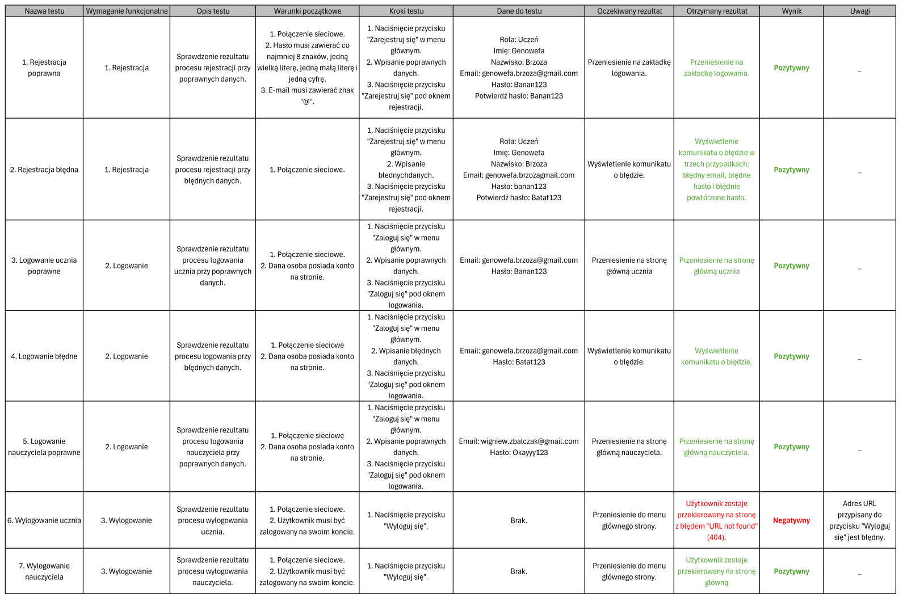
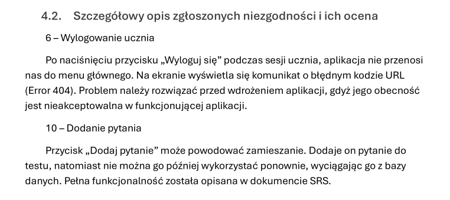
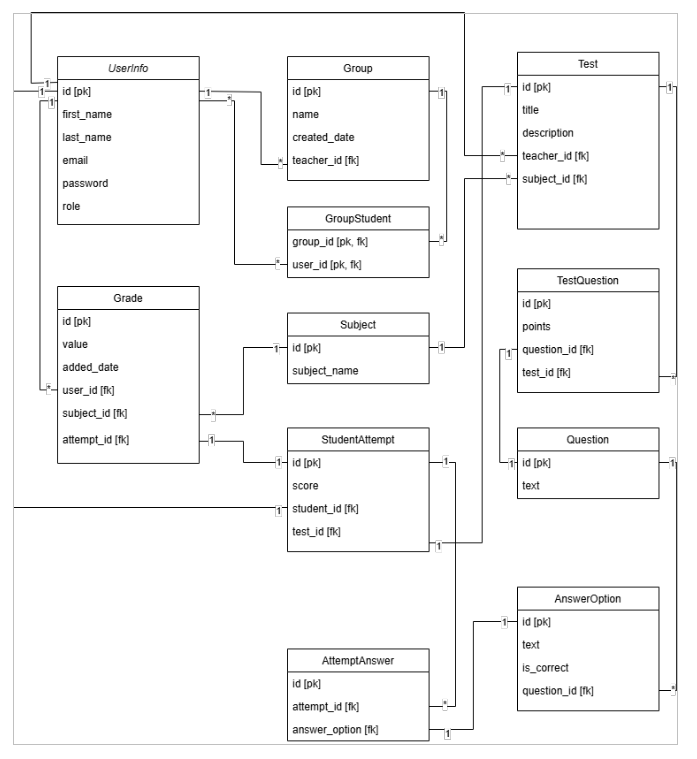
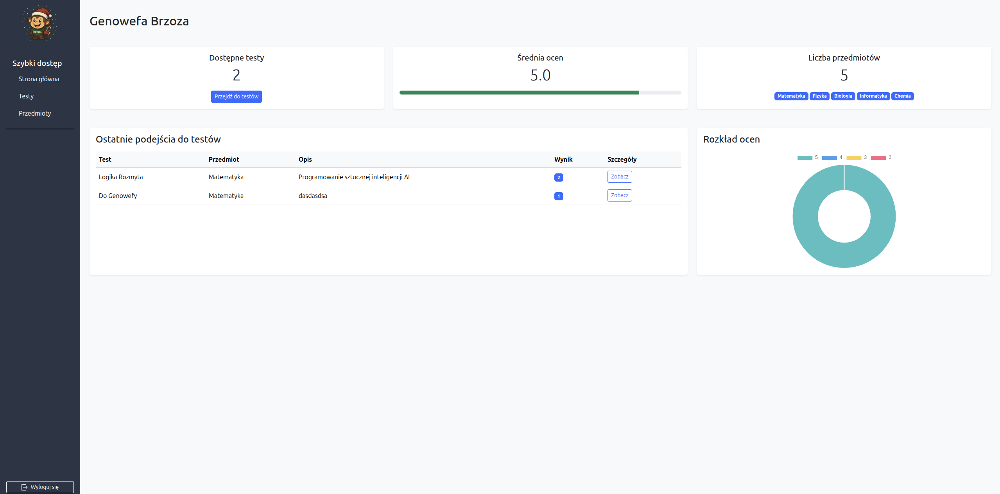
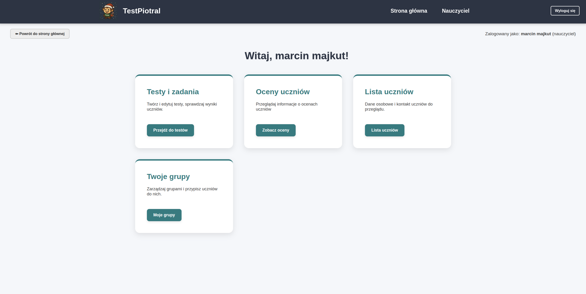
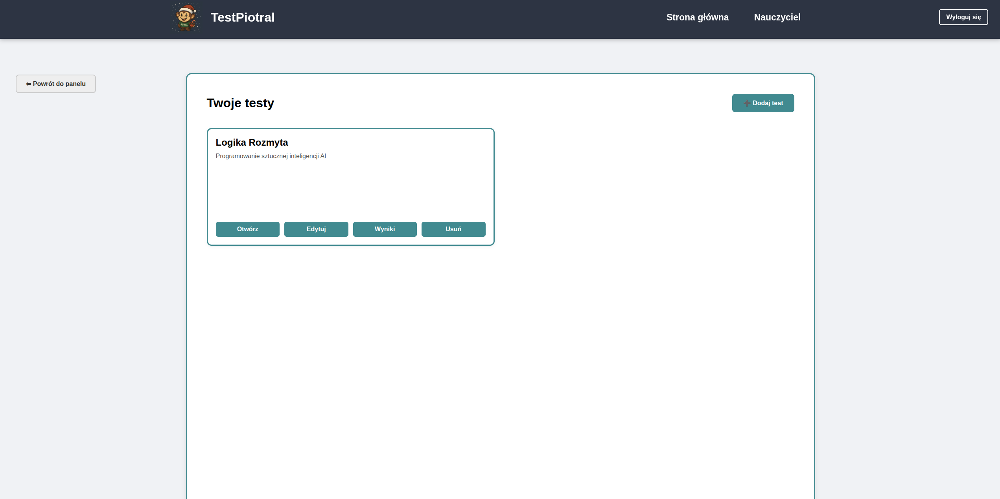
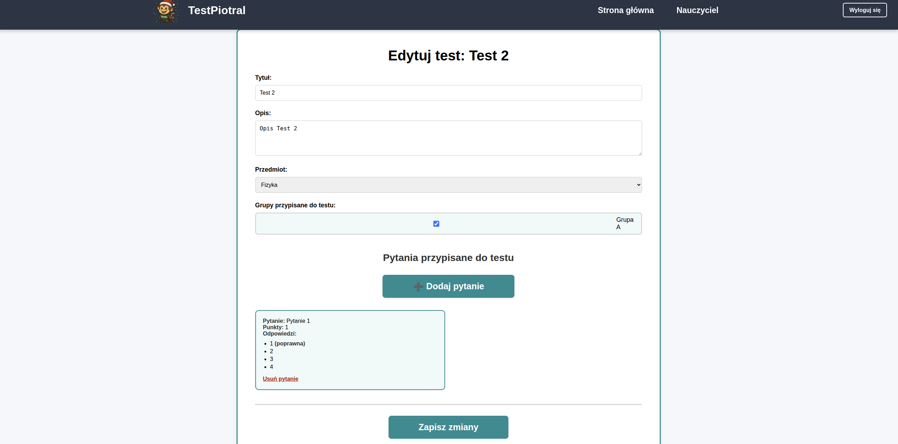
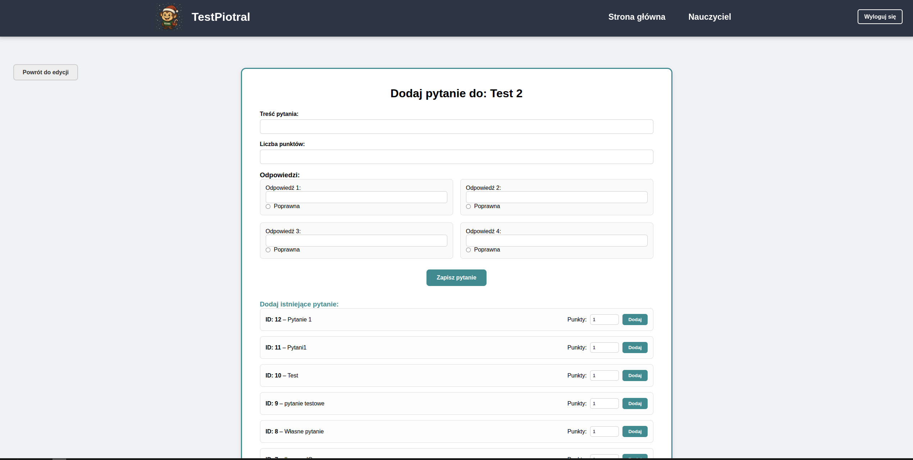
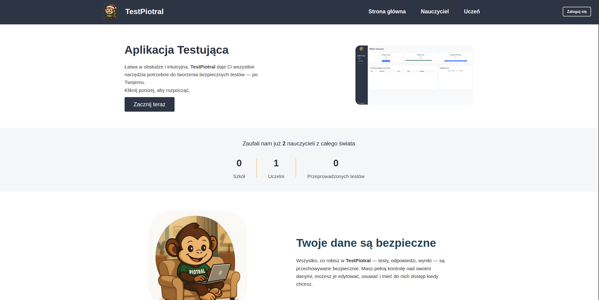

#Flask School LMS

A comprehensive School Learning Management System (LMS) built with Python and Flask. This application facilitates interaction between teachers and students, allowing for group management, test creation, grading, and progress tracking.

**Note:** This project serves as a practical implementation of the **Software Testing Life Cycle (STLC)**, demonstrating both development and rigorous Quality Assurance processes.

## Features

* **Role-Based Access Control:** Distinct panels for **Teachers** and **Students**.
* **Student Panel:**
    * Take assigned tests and quizzes.
    * View grade history and calculate average scores.
    * Track progress across different subjects.
    * Review past test attempts and results.
* **Teacher Panel:**
    * Create, edit, and delete tests with custom questions.
    * Manage student groups (add/remove students).
    * View results and grade specific attempts.
    * Manually add grades for subjects.
* **Database Integration:** Uses SQLite with SQLAlchemy ORM for efficient data management.
* **Automatic Seeding:** Automatically initializes default subjects (Math, Physics, IT, etc.) upon first launch.

## Quality Assurance & Documentation

This project was developed with a "Quality First" approach. The development lifecycle included a full **QA process** covering Requirement Analysis, Test Planning, and Execution.

### Documentation Artifacts
The repository includes comprehensive QA documentation (available in the `/docs` folder or upon request):
* **SRS (Software Requirements Specification):** Detailed functional & non-functional requirements, Use Cases, and logic definitions.
* **Test Scenarios & Cases:** Structured test cases covering Positive, Negative, and Boundary Value Analysis (BVA) scenarios.
* **Test Report:** Final summary of testing activities, including metrics (Pass/Fail rate) and defect density.

### Testing Methodology
* **Manual Testing:** Performed extensive functional testing on UI and Business Logic layers.
* **Techniques Used:**
    * **Equivalence Partitioning & BVA:** Applied to registration forms (password complexity) and grade calculations.
    * **Exploratory Testing:** Used to identify edge cases in the "Take Test" flow.
    * **SQL Verification:** Direct database queries used to verify data integrity (e.g., verifying `User-Group` relationships) against UI inputs.
* **Defect Management:** Identified and documented critical bugs, such as:
    * *Critical:* Broken Logout redirection (404 Error).
    * *High:* Integration failure when adding questions to the global bank.

## Project Gallery & QA Artifacts

### Quality Assurance & Documentation
Evidence of the STLC process, including requirements analysis and defect reporting.

| **Test Cases (Execution)** | **Defect Reporting** |
|:---:|:---:|
|  |  |
| *Structured test cases with Pass/Fail status* | *Detailed defect analysis (e.g., 404 Logout Error)* |

| **Database Schema (ERD)** | **Requirements (SRS)** |
|:---:|:---:|
|  |  |
| *Entity Relationship Diagram showing PK/FK constraints* | *Contextual architecture and requirements* |

### Student Zone Interface
Key functionalities available for students.

| **Dashboard & Stats** | **Taking a Test** |
|:---:|:---:|
|  |  |
| *View grade average, available tests, and history* | *Distraction-free interface for solving quizzes* |

### Teacher Zone Interface
Management tools for educators.

| **Teacher Dashboard** | **Test Management** |
|:---:|:---:|
|  |  |
| *Central hub for groups and grades* | *Overview of created tests with edit options* |

| **Test Creation Wizard** | **Question Editor** |
|:---:|:---:|
|  |  |
| *Configuring test details and groups* | *Adding questions and defining answers* |

### General
| **Landing Page** |
|:---:|
|  |
| *Main entry point describing platform features* |

## Tech Stack

* **Language:** Python 3.x
* **Framework:** Flask
* **Database:** SQLite, SQLAlchemy (Flask-SQLAlchemy)
* **Templating:** Jinja2
* **Frontend:** HTML5, CSS3 (Bootstrap-ready structure)
* **QA Tools:** Manual Testing, SQL, Excel/PDF Reporting

## Getting Started

Follow these instructions to set up and run the project locally on your machine.

### Prerequisites

* Python 3.8 or higher installed.
* Git (for cloning the repository).

## Quick Start

```bash```
1. **Clone & Setup**
    git clone https://github.com/Jahgodka/flask-school-lms.git
    cd flask-school-lms
    python -m venv venv
    source venv/bin/activate  # Windows: .\venv\Scripts\activate
    pip install -r requirements.txt

2. **Run** (Database initializes automatically on first run)
    export FLASK_DEBUG=1      # Optional
    python app.py

### Running the Application

1.  **Start the server**
    Run the application using Python. This will automatically create the database file (`instance/database.db`) and seed default subjects if they don't exist.
    ```bash
    python app.py
    ```

2.  **Access the App**
    Open your web browser and navigate to:
    ```
    http://127.0.0.1:5000/
    ```

3.  **First Steps**
    * Go to the **Register** page.
    * Create a **Teacher** account first to set up groups and tests.
    * Create a **Student** account to test the taking of quizzes.

## Project Structure

* `app.py`: Main application entry point and route definitions.
* `models.py`: Database models (User, Test, Question, Grade, etc.).
* `templates/`: HTML templates for the user interface.
* `instance/`: Contains the SQLite database (created after running the app).
* `requirements.txt`: List of Python dependencies.
